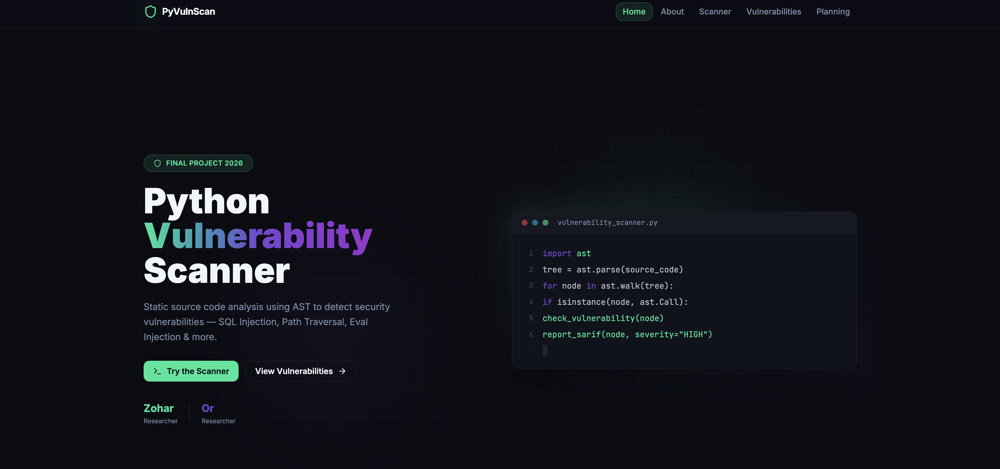
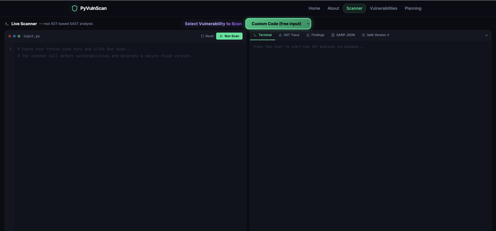
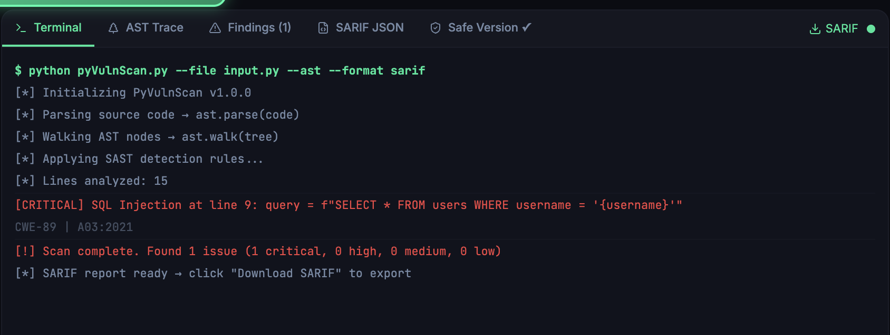
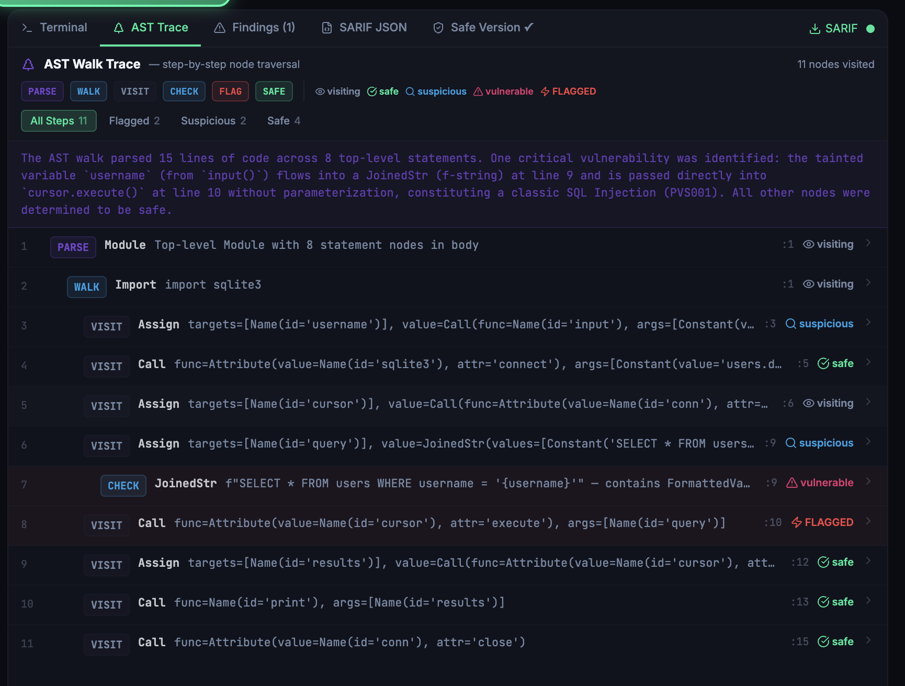

# 🔐 Python SAST Scanner


Static Application Security Testing (SAST) platform for detecting security vulnerabilities in Python applications through AI-assisted security analysis, SARIF reporting, and interactive findings visualization.


## 🔗 Quick Links

| Resource | Description |
|-----------|-------------|
|  Live Demo | https://scan-python-safe.base44.app |
|  Scanner CLI | [Scanner Documentation](scanner/README.md) |
|  Web Dashboard | [UI Documentation](ui/README.md) |
| GitHub Action | [GitHub Action Usage](scanner/README.md#github-action-usage) |
| Docker Usage | [Docker Guide](scanner/README.md#-docker-usage) |
|  Sample Applications | [Vulnerable Samples](samples/) |


##  Project Overview

This project provides an end-to-end Static Application Security Testing (SAST) solution for Python applications.

The platform analyzes Python source code with Claude, identifies security vulnerabilities, generates structured findings in SARIF format, and visualizes the results through an interactive React dashboard.

The project demonstrates the complete workflow used by modern SAST tools:

**Source Code → AI-Assisted Security Analysis → SARIF Generation → Findings Visualization**


## Architecture

The project currently has two scanning entry points because the CLI and the web application run in different deployment environments.

```text
CLI / GitHub Action
        │
        ▼
scanner/scanner.js
        │
        ▼
 Text / JSON / SARIF


React Dashboard
        │
        ▼
Base44 scanPythonCode function
        │
        ▼
 Dashboard Findings
```

The CLI and GitHub Action use the Node.js scanner engine in `scanner/scanner.js`. The React dashboard uses a Base44 backend function because it runs in the Base44 deployment environment and cannot directly execute the local CLI module.

### Known Limitation

The scanner prompt and response-processing logic currently exist in both the Node.js scanner and the Base44 function. This duplication can cause the two scanning paths to behave differently as the project evolves.

### Future Architecture

A future version should expose the scanner engine through a shared HTTP API. The CLI, GitHub Action, and React dashboard would then call the same service, providing one source of truth for prompts, model configuration, and result processing.


##  Main Features

* Static analysis of Python source code
* AI-assisted AST-style code inspection
* Security vulnerability detection
* SARIF 2.1.0 report generation
* Interactive findings dashboard
* Code snippet visualization
* Code flow visualization
* Dockerized scanner execution
* GitHub Actions integration
* SARIF upload and inspection
* Vulnerability severity reporting


## 🛠️ Technologies Used

### Scanner Engine

* Node.js
* Claude API
* AI-assisted static security analysis
* JSON and SARIF 2.1.0 output

### User Interface

* React
* JavaScript (ES6)
* Vite
* HTML5
* CSS3
* Base44

### DevOps & Automation

* Docker
* GitHub Actions
* YAML

### Development Tools

* Git
* GitHub
* VS Code


## 🔍 Supported Vulnerabilities

| Vulnerability | CWE | Description |
| --- | --- | --- |
| SQL Injection | [CWE-89](https://cwe.mitre.org/data/definitions/89.html) | User input embedded directly into SQL queries |
| OS Command Injection | [CWE-78](https://cwe.mitre.org/data/definitions/78.html) | User input passed to operating system commands |
| Path Traversal | [CWE-22](https://cwe.mitre.org/data/definitions/22.html) | User-controlled file paths used without validation |
| Code Injection | [CWE-94](https://cwe.mitre.org/data/definitions/94.html) | Untrusted input passed to eval() or exec() |
| Cross-Site Scripting (XSS) | [CWE-79](https://cwe.mitre.org/data/definitions/79.html) | User input rendered into HTML without escaping |
| Hardcoded Secrets | [CWE-200](https://cwe.mitre.org/data/definitions/200.html) | Credentials embedded directly in source code |
| Insecure Deserialization | [CWE-502](https://cwe.mitre.org/data/definitions/502.html) | Unsafe deserialization using pickle.loads() |
| Server-Side Request Forgery (SSRF) | [CWE-918](https://cwe.mitre.org/data/definitions/918.html) | User-controlled URLs used in server-side requests |
| Weak Cryptography | [CWE-327](https://cwe.mitre.org/data/definitions/327.html) / [CWE-328](https://cwe.mitre.org/data/definitions/328.html) | Weak hashing algorithms and insecure randomness |
| Missing Authorization | [CWE-862](https://cwe.mitre.org/data/definitions/862.html) | Sensitive operations performed without permission checks |


##  Project Structure

```text
final-project-sast
│
├── scanner/          # Scanner engine, CLI, SARIF generation
├── ui/               # React findings visualization dashboard
├── samples/          # Vulnerable sample applications
└── README.md
```


## 🔄 Workflow

### 1. Scan

Submit Python source code through the CLI, Docker container, or GitHub Action.

### 2. Analyze

Use Claude to identify security vulnerabilities and produce structured findings.

### 3. Generate

Create results in text, JSON, or SARIF 2.1.0 format.

### 4. Upload

Upload SARIF results to GitHub Code Scanning or load scan results into the dashboard.

### 5. Visualize

Explore findings, code snippets, vulnerability descriptions, severity levels, and suggested fixes.


## 📸 Screenshots

###  Home Page

<p align="center">
  
</p>


###  Findings Dashboard

<p align="center">
  
</p>


###  Vulnerability Details View

<p align="center">
  
</p>


###  Code Flow Visualization

<p align="center">
  
</p>


## 🎓 Academic Project

**B.Sc. Computer Science – Final Project**

**Bar-Ilan University | 2026**

### Research Areas

* Static Application Security Testing (SAST)
* Secure Software Engineering
* Vulnerability Detection
* AI-Assisted Security Analysis
* Static Program Analysis
* SARIF-Based Security Reporting
* Security Findings Visualization

Developed as a proof-of-concept security scanner demonstrating how AI-assisted analysis can detect and report security vulnerabilities in Python applications.
